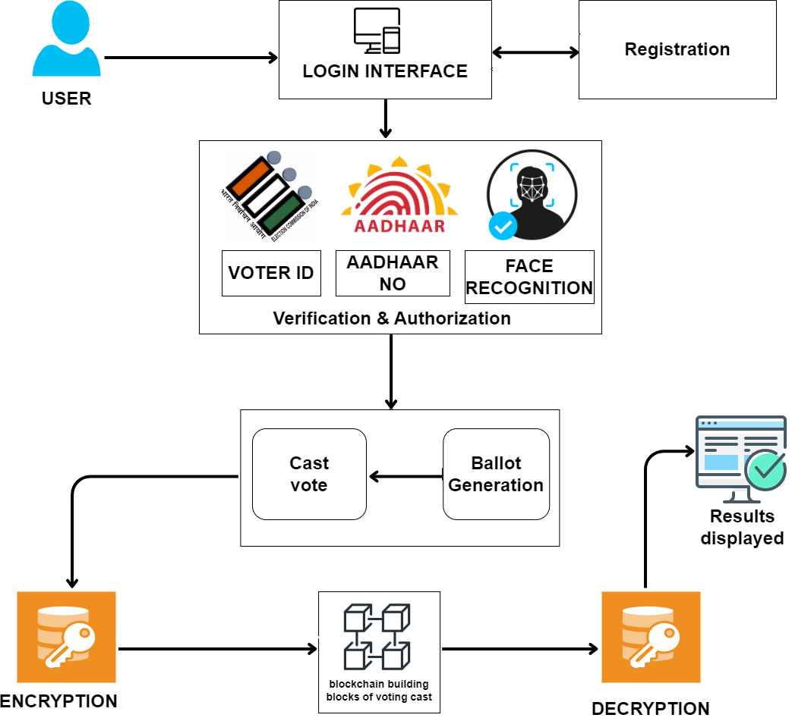

<h1 style="color: #6a5acd; font-size: 2.5em; text-shadow: 2px 2px 8px #ff6347;">Smart-Voting-System</h1>

<strong>Smart Voting System Using Blockchain Technology</strong>

<h2 style="color: #4682b4; text-shadow: 1px 1px 6px #32cd32;">Project Overview:</h2>

The Smart Voting System Using Blockchain Technology is an innovative online voting platform that aims to provide a secure, transparent, and efficient method for conducting elections...

<h2 style="color: #4682b4; text-shadow: 1px 1px 6px #32cd32;">Features:</h2>

<h3 style="color: #8b4513;">Blockchain Integration:</h3>

Utilizes blockchain technology to securely record each vote as a transaction, ensuring immutability and transparency...

<h3 style="color: #8b4513;">Multi-Layered Authentication:</h3>

Voter verification through multiple levels of security...

<h3 style="color: #8b4513;">Cryptographic Security:</h3>

SHA-256 hashing for securing votes and voter information...

<h3 style="color: #8b4513;">User-Friendly Voting Interface:</h3>

A simple and intuitive web-based interface for casting votes, reviewing selections, and confirming choices...

<h3 style="color: #8b4513;">Tamper-Proof Voting Process:</h3>

Each vote is recorded on the blockchain, making it impossible to alter once recorded...

<h2 style="color: #4682b4; text-shadow: 1px 1px 6px #32cd32;">System Architecture:</h2>

  

<h3 style="color: #8b4513;">User Authentication Module:</h3>

Ensures secure login with Voter ID, Aadhaar, and face recognition...

<h3 style="color: #8b4513;">Verification Module:</h3>

Cross-verifies the voter’s details using a combination of Voter ID, Aadhaar number, and facial recognition technology...

<h3 style="color: #8b4513;">Voting Interface Module:</h3>

Provides a web-based interface for casting votes, including real-time verification and feedback mechanisms...

<h3 style="color: #8b4513;">Blockchain Integration Module:</h3>

Records each vote as a transaction on the blockchain, providing a transparent and immutable ledger of votes...

<h2 style="color: #4682b4; text-shadow: 1px 1px 6px #32cd32;">Technologies Used:</h2>

<strong>Programming Languages:</strong> Python, JavaScript

<strong>Web Technologies:</strong> HTML, CSS

<strong>Cryptography:</strong> SHA-256, RSA Encryption

<h2 style="color: #4682b4; text-shadow: 1px 1px 6px #32cd32;">How It Works:</h2>
<ol>
  <li>Voters log in with their Voter ID and Aadhaar, followed by facial recognition for added security...</li>
  <li>Upon successful verification, the voter is given a digital ballot to cast their vote...</li>
</ol>

<h2 style="color: #4682b4; text-shadow: 1px 1px 6px #32cd32;">Project Screenshots:</h2>

  
  
  <!-- add remaining screenshots here -->

